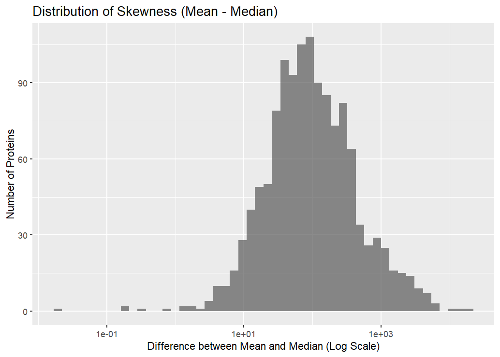
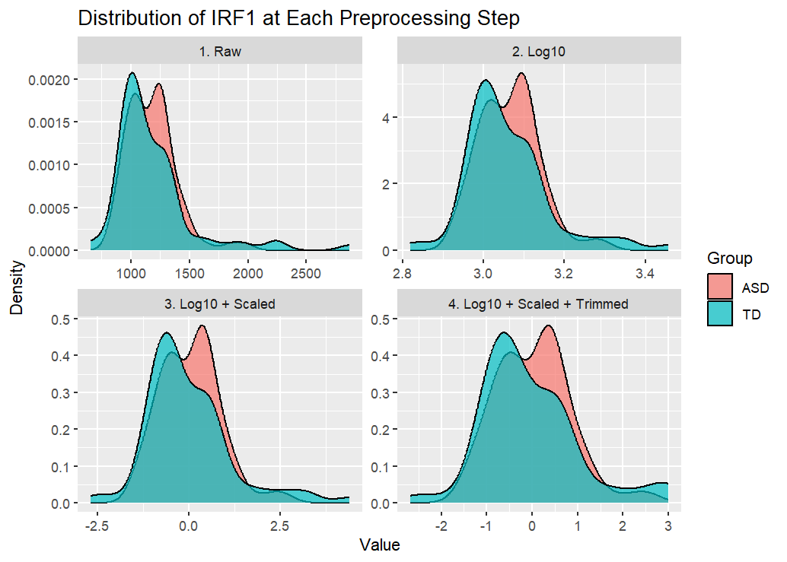
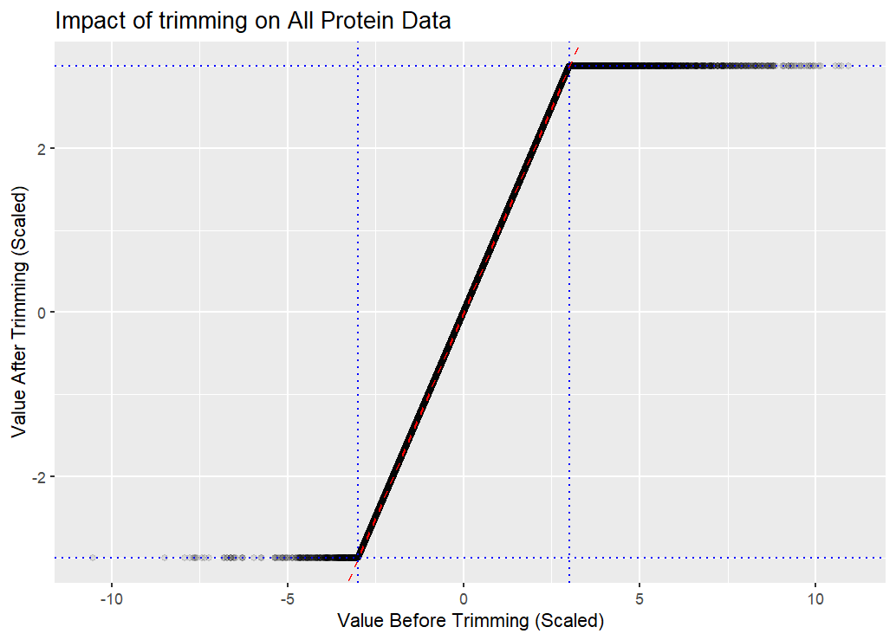

```{r}
# load any other packages and read data here
library(tidyverse)
library(tidymodels)
library(randomForest)
library(modelr)
library(yardstick)
```

## Abstract

Our report analyzes serum protein biomarkers related to autism spectrum disorder (ASD) using data from Hewitson et al. (2021). The dataset included 154 male children (76 diagnosed with ASD and 78 typically developing) and over 1,100 quantified proteins. Across four main tasks, we examined how data preprocessing and modeling choices affect biomarker discovery and classification accuracy. In the first two tasks, we explored how log-transformation and outlier trimming improved data quality and reduced skewness. In Task 3, we tested different analysis setups, including using a proper train/test split, selecting more top proteins, and combining feature rankings with a fuzzy intersection approach. These changes improved generalizability and model performance, with the best configuration reaching an AUC of 0.761 and accuracy of 0.745. In the final task, we compared LASSO logistic regression and Random Forest models, finding that LASSO achieved the highest AUC (0.92) while remaining simpler and more interpretable. Overall, our results show that thoughtful preprocessing and model design can significantly improve the reliability of ASD biomarker identification.

## Dataset

The data came from serum samples collected from 154 male children, including 76 diagnosed with autism spectrum disorder and 78 typically developing controls, within ages 18 months old to 8 years old. Blood samples were analyzed using a multiplex proteomic assay that quantified 1,317 proteins. After quality control, 1,125 proteins were retained for statistical analysis. The data set also included variables such as age, comorbidities, medication, and behavioral measures of ASD symptoms. As for the preprocessing, the authors performed log-transformation, centering and scaling of protein concentrations, and trimming of outliers. Ultimately, this data set identified proteins that showed different expressions between ASD and TD groups. It also helped with building predictive models of ASD classification.

## Summary of published analysis

### Methodology
The study aimed to identify a panel of serum proteins that could serve as a blood biomarker for ASD in boys. Researchers started with serum samples from 154 male children (76 diagnosed with ASD and 78 typically developing). Using a SOMAScan assay, they analyzed the levels of 1,125 different proteins in these samples. To find the most predictive proteins, the authors used a combined three-part approach:

- Random Forest (RF): A machine learning method was used to rank proteins based on their importance in classifying a subject as ASD or TD.

- T-test: A statistical test was used to find the proteins that showed the most significant difference in average levels between the ASD and TD groups.

- Correlation Analysis: This method identified proteins whose levels were most strongly correlated with ASD severity, which was measured by the ADOS total score.

The researchers first identified the top 10 proteins from each of the three methods. They found 5 proteins that appeared on all three top-10 lists. Then they tested the remaining proteins from the lists to see if adding them to the 5-protein core improved the model's predictive power. By doing so, they identified 4 additional proteins and created a final, optimized 9-protein panel.

### Results

The 5 proteins identified as top predictors by all three methods were IgD, DERM, MAPK14, EPHB2, suPAR. The final 9-protein panel included these 5 core proteins plus the following 4 proteins that provided additive predictive power: ROR1, GI24, eIF-4H, ARSB.

The estimated metrics of the classifier were:

- Area Under the Curve (AUC): $0.8599 \pm 0.0640$

- Sensitivity: $0.835 \pm 0.1176$

- Specificity: $0.8217 \pm 0.1178$


## Findings
### Impact of preprocessing and outliers (Joy)
Tasks 1-2

The data preprocessing steps, defined in `scripts/preprocessing.R`, transform the data to make it suitable for modeling. They correct for outliers and data skew.

#### Outlier Problem
The outliers problem is shown in Figure 1, which plots the distribution of the mean - median difference for all 1,125 proteins. In a symmetrical distribution, the mean and median are nearly identical, so their difference would be close to 0. However, Figure 1 shows that for the vast majority of proteins, the mean is significantly larger than the median. For example, there are more than 100 proteins whose means are $10^2$ (100) points higher than their medians, since the x-axis is on a log scale. This indicates a right-skew across the whole dataset. These outliers make the raw data distributions uninterpretable and would violate the assumptions of many statistical models.



#### Preprocessing Steps
The preprocessing pipeline provided in `preprocessing.R` addresses this problem in steps. We picked protein IRF1 to Figure 2 visualizes the effect of each step on the IRF1 protein:

- 1. Raw: The data in this plot is so skewed by outliers that the entire distribution is at the far left, and the x-axis is stretched out.

- 2. Log10: The `log10()` transformation pulls in the extreme high-value outliers, transforming the heavily skewed data into a more symmetric distribution. The x-axis is now in log-space and the underlying structure of the data for the two groups (ASD vs. TD) is visible.

- 3. Log10 + Scaled: This step applies a standard `scale()` (centering and scaling) to the log-transformed data. The shape of the distribution is identical to Panel 2, but the x-axis is now centered around 0 and in units of standard deviation. The scaling allows all proteins to be comparable and prepares for the trimming step.

- 4. Log10 + Scaled + Trimmed: This plot shows the final data after applying the `trim()` function. For this specific protein, the distribution looks virtually identical to Panel 3, suggesting that few IRF1 data points were outside the trim threshold.



#### Preprocessing: Trimming
The `trim()` function is the final outlier-handling step, which caps all scaled values at an absolute threshold of 3. While its effect on the shape of the IRF1 distribution in Figure 1 was minimal, its impact across the entire dataset is significant.

Figure 3 plots the "before" vs. "after" value for every single protein measurement in the dataset. 

- The dense cluster of points along the red dashed $y=x$ line represents the vast majority of data points that were unaffected because their scaled values were already between -3 and 3.

- The horizontal line of points at $y = 3$ shows all the high-value outliers. Their original scaled values on the x-axis ranged from 3 to over 10, but the `trim()` function pulled them down and capped their final value at exactly 3.

- Similarly, the horizontal line at $y = -3$ shows the low-value outliers that were pushed up and capped at -3.



By calculating the total data points and the data points trimmed, we got that the trimming function was applied to 2,379 data points, which is 1.173% of the total dataset. This shows the substantial impact of the trimming step in the preprocessing pipeline. 

In conclusion, the preprocessing pipeline uses a log-transformation to correct for severe biological skew, scales the log-transformed data, and then applies a trimming function to remove the most extreme values. This ensures the final data is robust and suitable for modeling.


### Methodological variations (Anna and Johanna)
Task 3

We explored how different methodological choices affect biomarker classification results for distinguishing ASD from TD participants. Using the provided cleaned serum protein dataset, we implemented a proper train/test split to prevent data leakage, performed feature selection with both t-tests and Random Forests on the training set, and combined their outputs using a fuzzy intersection approach. This method assigned adjustable weights to the statistical and machine learning scores to identify the most robust proteins. The best-performing configuration (RF-heavy weighting of 0.3/0.7) achieved an AUC of 0.761 and accuracy of 0.745, highlighting proteins such as FSTL1, MRC2, TSP4, DR6, and Notch 1 as key features for classification.

Each method modification noticeably affected the results and gave useful insights into the model’s behavior. The first modification, applying a proper train/test split, worked as intended. By performing feature selection only on the training data, the model avoided data leakage and produced more realistic performance estimates. The performance metrics (AUC around 0.69–0.76 and accuracy around 0.64–0.75) give an honest picture of how the model would perform on unseen data. These results are more conservative than what we would get if feature selection were done on the entire dataset, which would likely lead to overly optimistic performance.

The second modification, increasing the number of proteins used in the selection process, also improved the workflow. By selecting 20 proteins instead of 10, the model had a larger pool to draw from during fuzzy intersection, which prevented the issue of “no proteins selected” that can happen with strict intersections. The final selection included 15 proteins, showing that expanding the feature set helps maintain stability and coverage across different selection strategies.

The third modification, adding fuzzy intersection with different weighting strategies, had the most noticeable effect on performance. The equal-weight strategy (0.5/0.5) achieved an AUC of 0.69 and accuracy of 0.638, producing a balanced selection that included proteins like FSTL1, DR6, and Notch 1—proteins that performed well in both methods. The t-test-heavy weighting (0.7/0.3) slightly improved the AUC to 0.71 and accuracy to 0.66, giving more weight to statistical significance and ranking DERM higher, though it favored specificity (0.792) over sensitivity (0.522). The RF-heavy weighting (0.3/0.7) performed the best overall, with an AUC of 0.761 and accuracy of 0.745, offering a better balance between sensitivity (0.739) and specificity (0.75). It also changed the top protein rankings, bringing MRC2 and TSP4 into higher positions. Across all weighting methods, FSTL1 remained the top protein (score around 0.999), while others shifted depending on the weighting. Overall, the fuzzy intersection approach proved effective in combining the strengths of both the t-test and random forest methods, improving performance and producing a more robust and interpretable feature selection process.


### Improved classifier (Cathy and Lorretta)
Task 4

We evaluated two machine learning approaches for classifying participants as ASD or TD based on blood protein biomarkers. Using the cleaned data set, we first split the data into training (80%) and testing (20%) subsets. A LASSO Logistic Regression Model was implemented through the tidymodels framework, with five-fold cross-validation used to tune the penalty parameter (lambda) to balance model simplicity and predictive accuracy. The LASSO Model applies regularization to shrink less informative protein coefficients toward zero, thereby identifying a smaller "core" biomarker panel. In parallel, an Improved Random Forest model with 1,000 trees was trained using the same training data to serve as a non-linear benchmark. Both models were evaluated on the test set using standard classification metrics: accuracy, sensitivity, specificity, and ROC AUC, to assess their predictive performance and compare model efficiency versus complexity.

Both LASSO and Improved Random Forest models were evaluated on their ability to distinguish between ASD and TD participants using the biomarker data set. The Simpler LASSO panel achieved a higher ROC AUC value of 0.917, compared to 0.829 for the Improved Random Forest model, indicating that the LASSO classifier was better at ranking ASD cases above TD cases overall. The Random Forest achieved an accuracy of 0.774, with sensitivity equal to 0.667 and specificity equal to 0.875, showing that it correctly identified most TD cases but missed a portion of ASD cases. In contrast, the LASSO model produced a smoother ROC curve with superior area under the curve, demonstrating stronger discriminative ability despite relying on fewer proteins. 

Although both the LASSO and Random Forest models demonstrated strong classification performance in distinguishing ASD from TD participants, their methodological approaches and outcomes highlight distinct advantages. LASSO’s built-in feature selection produced a concise biomarker panel. This emphasizes parsimony and reproducibility. In contrast, the Random Forest offered greater flexibility to model nonlinear interactions and complex dependencies among proteins. The model’s broader feature importance distribution suggests that ASD-related patterns may involve subtle relationships beyond simple additive effects. 

Overall, this suggests that the LASSO approach not only simplifies the biomarker panel but also improves classification accuracy relative to both the Random Forest and the original in-class model. The comparison demonstrates that LASSO is better suited for identifying interpretable biomarkers, whereas Random Forest provides complementary insights into potential nonlinear relationships.